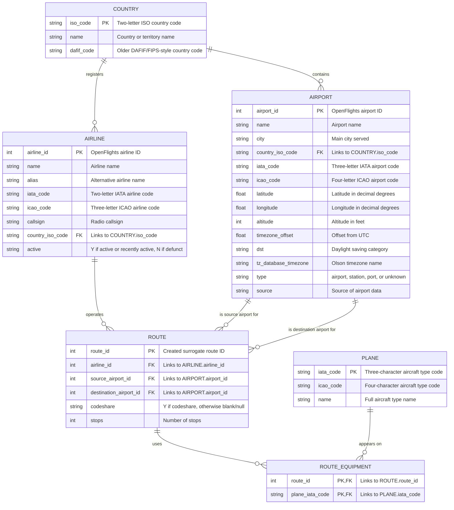

```mermaid
erDiagram

    COUNTRY ||--o{ AIRPORT : contains
    COUNTRY ||--o{ AIRLINE : registers

    AIRLINE ||--o{ ROUTE : operates

    AIRPORT ||--o{ ROUTE : "is source airport for"
    AIRPORT ||--o{ ROUTE : "is destination airport for"

    ROUTE ||--o{ ROUTE_EQUIPMENT : uses
    PLANE ||--o{ ROUTE_EQUIPMENT : "appears on"

    COUNTRY {
        string iso_code PK "Two-letter ISO country code"
        string name "Country or territory name"
        string dafif_code "Older DAFIF/FIPS-style country code"
    }

    AIRPORT {
        int airport_id PK "OpenFlights airport ID"
        string name "Airport name"
        string city "Main city served"
        string country_iso_code FK "Links to COUNTRY.iso_code"
        string iata_code "Three-letter IATA airport code"
        string icao_code "Four-letter ICAO airport code"
        float latitude "Latitude in decimal degrees"
        float longitude "Longitude in decimal degrees"
        int altitude "Altitude in feet"
        float timezone_offset "Offset from UTC"
        string dst "Daylight saving category"
        string tz_database_timezone "Olson timezone name"
        string type "airport, station, port, or unknown"
        string source "Source of airport data"
    }

    AIRLINE {
        int airline_id PK "OpenFlights airline ID"
        string name "Airline name"
        string alias "Alternative airline name"
        string iata_code "Two-letter IATA airline code"
        string icao_code "Three-letter ICAO airline code"
        string callsign "Radio callsign"
        string country_iso_code FK "Links to COUNTRY.iso_code"
        string active "Y if active or recently active, N if defunct"
    }

    PLANE {
        string iata_code PK "Three-character aircraft type code"
        string icao_code "Four-character aircraft type code"
        string name "Full aircraft type name"
    }

    ROUTE {
        int route_id PK "Created surrogate route ID"
        int airline_id FK "Links to AIRLINE.airline_id"
        int source_airport_id FK "Links to AIRPORT.airport_id"
        int destination_airport_id FK "Links to AIRPORT.airport_id"
        string codeshare "Y if codeshare, otherwise blank/null"
        int stops "Number of stops"
    }

    ROUTE_EQUIPMENT {
        int route_id PK, FK "Links to ROUTE.route_id"
        string plane_iata_code PK, FK "Links to PLANE.iata_code"
    }
```